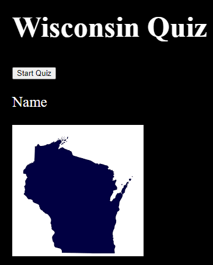

# Wisconsin Quiz
## Description

The quiz is a multiple choice quiz that asks the user questions about Wisconsin. The user is given the ability to choose an answer and then is told if they are correct or not. The user is also given a the options to submit their score to a leader board.

- To create a quiz for the Wisconsin Department of Tourism.
- Why did you build this project? - To test the users knowledge of Wisconsin.
- I learned how to create a multiple choice option and and add a timer to the quiz.

## Usage

You will press the start button to start the quiz. You will then be asked a series of questions. You will be given 4 options to choose from. You will have 90 seconds to complete the quiz. When you have completed the quiz you will be given the option to submit your score to the leader board.

## Credits

Walter Perry

## License

MIT License
Copyright (c) [2023] [Bret Kruse]

Permission is hereby granted, free of charge, to any person obtaining a copy
of this software and associated documentation files (the "Software"), to deal
in the Software without restriction, including without limitation the rights
to use, copy, modify, merge, publish, distribute, sublicense, and/or sell
copies of the Software, and to permit persons to whom the Software is
furnished to do so, subject to the following conditions:

The above copyright notice and this permission notice shall be included in all
copies or substantial portions of the Software.

THE SOFTWARE IS PROVIDED "AS IS", WITHOUT WARRANTY OF ANY KIND, EXPRESS OR
IMPLIED, INCLUDING BUT NOT LIMITED TO THE WARRANTIES OF MERCHANTABILITY,
FITNESS FOR A PARTICULAR PURPOSE AND NONINFRINGEMENT. IN NO EVENT SHALL THE
AUTHORS OR COPYRIGHT HOLDERS BE LIABLE FOR ANY CLAIM, DAMAGES OR OTHER
LIABILITY, WHETHER IN AN ACTION OF CONTRACT, TORT OR OTHERWISE, ARISING FROM,
OUT OF OR IN CONNECTION WITH THE SOFTWARE OR THE USE OR OTHER DEALINGS IN THE
SOFTWARE.